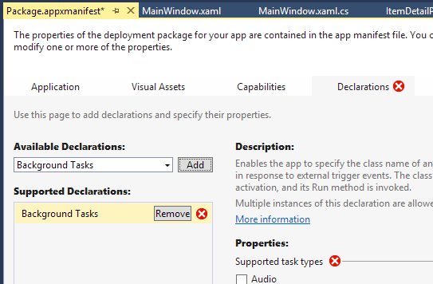
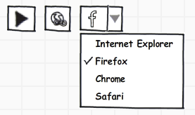
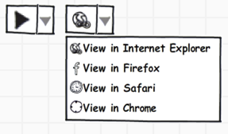

# UX Essentials for Visual Studio
[!INCLUDE[vs2017banner](../../includes/vs2017banner.md)]

## Best practices

### 1. Be consistent within the Visual Studio environment.

- Follow existing interaction patterns within the shell.

- Design features to be consistent with the shell’s visual language and craftsmanship requirements.

- Use shared commands and controls when they exist.

- Understand the Visual Studio hierarchy and how it establishes context and drives the UI.

### 2. Use the environment service for fonts and colors.

- UI should respect the current environment font setting unless it is exposed for customization in the Fonts and Colors page in the Options dialog.

- UI elements must use the VSColor Service, using shared environment tokens or feature-specific tokens.

### 3. Make all imagery consistent with the new VS style.

- Follow Visual Studio design principles for icons, glyphs, and other graphics.

- Do not place text in graphic elements.

### 4. Design from a user-centric perspective.

- Create the task flow before the individual features within it.

- Be familiar with your users and make that knowledge explicit in your spec.

- When reviewing the UI, evaluate the complete experience as well as the details.

- Design your UI so that it remains functional and attractive regardless of locale or language.

## Screen resolution

### Minimum resolution
 The minimum resolution for Visual Studio Dev14 is 1280x1024. This means that it is *possible* to use Visual Studio at this resolution, although it might not be an optimal user experience. There is no guarantee that all aspects will be usable at resolutions lower than 1280x1024.

 Initial dialog size should not exceed 1000 pixels in height so as to fit within the frame of the IDE within this minimum resolution at 96 dpi.

### High-density displays
 UI in Visual Studio must work well in all DPI scaling factors that Windows supports out of the box: 150%, 200%, and 250%.

## Anti-patterns
 Visual Studio contains many examples of UI that follow our guidelines and best practices. In an effort to be consistent, developers often borrow from product UI design patterns similar to what they're building. Although this is a good approach that helps us drive consistency in user interaction and visual design, we do on occasion ship features with a few details that do not meet our guidelines due to schedule constraints or defect prioritization. In these cases, we do not want teams to copy one of these "anti-patterns" because they proliferate bad or inconsistent UI within the Visual Studio environment.

### Required fields/settings shown in error state by default

#### Feature team goals

- Warn users that they have added an element that must be configured.

- Draw the user’s attention to the areas that need input.

#### Anti-pattern solution
 As soon as the user has initiated an action and before they have completed the task, immediately place critical-stop icons next to the areas that need configuration.

#### Example: Manifest Designer declarations
 Adding a declaration to the list immediately places it in an error state, which persists until the user sets the required properties.

 In this case, there is an additional concern because the icon used for the alert contains an “x”, so the common remove icon cannot be used beside it. As a result, the UI uses a Remove button, a more clunky control.

 

 **Placing UI in an error state by default is a Visual Studio anti-pattern.**

#### Alternatives
 A much better solution to this problem would be to:

- Allow the user to add a declaration without warning and then move immediately to set properties on the item.

- Add the warning icon (gold triangle) when focus moves from the item, such as to add another declaration to the list or to attempt to change tabs within the designer.

- If the user attempts to change tabs before setting properties on any declarations, pop a dialog explaining that the application will not build (or whatever the implications) until the warnings are resolved. If the user dismisses the dialog and changes tabs anyway then an icon (critical or warning, as appropriate) is added to the Declarations tab.

### Forcing the user to read text before dismissing UI

#### Feature team goals
 Don’t allow the user to dismiss the UI without first seeing the explanation text.

#### Anti-pattern
 The team inserting the video links into various places within the VS UI decided against the common pattern of an X close button and tooltip explanation as specified by UX, and instead implemented a dropdown and “Don’t show again” link.

 

 **Incorrect: forcing the user to read explanatory text before dismissing UI is an anti-pattern within Visual Studio.**

#### Result
 Instead of a simple close button (one click), the user is forced to use two clicks to simply dismiss the UI in every place that the video links appear.

#### Alternatives
 The correct design for this situation would be to follow the pattern common to Internet Explorer, Office, and Visual Studio: on hover, the user can see the tooltip description and one click hides the UI.

 

 **Correct: as designed, video links should display a tooltip with additional information on hover, and clicking the "X" should dismiss the message without need for further interaction.**

### Using command bars for settings
 

 **Figure A: Command bar anti-pattern**

 **Figure A** represents this anti-pattern: putting a setting underneath a command button that applies to more than just the command. In this sketch, there are commands besides Start Debugging — like View in Browser, Start Without Debugging, and Step Into — that will respect the selected setting.

 

 **Figure B: Better, but still a command bar anti-pattern**

 Slightly better, but still undesirable, is putting settings of this type in the toolbars, as shown in **Figure B**. While split buttons take less space and are therefore an improvement over drop-downs, both designs are still using a toolbar to promote something that isn't really a command.

 

 **Figure C: Correct use of Visual Studio command bar pattern**

 In **Figure C**, the setting is tied to a series of commands. There is no global setting being set and we're just switching between four commands. This is the only situation in which commands in the toolbar are acceptable.

### Control anti-patterns
 Some anti-patterns are simply incorrect usage or presentation of a control or group of controls.

#### Underlining used as a group label, not a hyperlink
 Underlining text should be used only for hyperlinks.

 **Bad:**

 

 **Underlined text that is not a hyperlink is a Visual Studio anti-pattern.**

 **Good:**

 

 **Styled correctly, non-hyperlink text appears unadorned in the environment font.**

#### Clicking on a check box results in a pop-up dialog
 Clicking the "Enable Remote Desktop for all roles" check box in the "Publish Windows Azure Application" wizard immediately brings up a pop-up dialog, a Visual Studio anti-pattern. In addition, the check box field does not fill with a check box after being selected, another interaction anti-pattern.

 

 **Bringing up a dialog after clicking a check box is a Visual Studio anti-pattern.**

### Hyperlink anti-patterns
 The following example contains two anti-patterns.

1. The foreground turning red on hover means that the correct shared color from the font service is not being used.

2. "Learn more" is not the appropriate text for a link to a conceptual topic. The user's goal is not to learn more, it is to understand the ramifications of their choice.

   

   **Ignoring the color service and using “Learn more” for hyperlinks are Visual Studio anti-patterns.**

   **Better solution:** Pose the question the user would be asking by clicking the link.

- How do Windows Azure services work?

- When do I need a Windows Azure Mobile Services project?

#### Using “Click here” for links
 Hyperlinks should be self-descriptive. It is an anti-pattern to use "Click here" or any similar variation.

 **Bad:** “Click here for instructions about how to create a new project.”

 **Good:** “How do I create a new project?”
